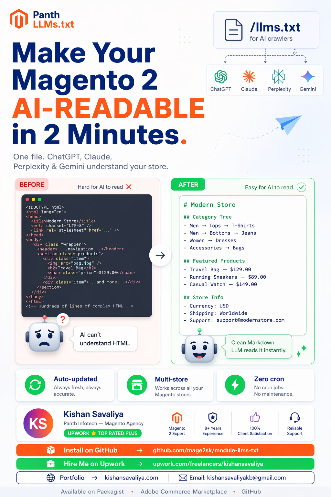

<!-- SEO Meta -->
<!--
  Title: Panth LLMs.txt - /llms.txt for Magento 2 | AI SEO for ChatGPT, Claude, Perplexity, Gemini | Panth Infotech
  Description: Panth LLMs.txt generates and serves /llms.txt and /llms-full.txt for Magento 2 — the emerging standard (llmstxt.org) that lets AI crawlers like ChatGPT, Claude, Perplexity and Gemini understand your catalog. Hierarchical category tree, curated featured / bestseller / recent products with short descriptions, per-store overview, priority URLs, collections, policy bodies. Multi-store, cache-backed, zero-config. Compatible with Magento 2.4.4 - 2.4.8, PHP 8.1 - 8.4, Hyva and Luma themes.
  Keywords: magento 2 llms.txt, magento 2 ai seo, magento 2 chatgpt indexing, magento 2 claude seo, magento 2 perplexity, magento 2 gemini seo, magento 2 ai crawler, hyva llms.txt, luma llms.txt, magento 2 llms-full.txt, magento 2 ai site map, llmstxt.org magento, magento 2 category tree ai, magento 2 featured products ai, magento 2 bestsellers llm
  Author: Kishan Savaliya (Panth Infotech)
  Canonical: https://github.com/mage2sk/module-llms-txt
-->

# Panth LLMs.txt — /llms.txt for Magento 2 | AI SEO for ChatGPT, Claude, Perplexity, Gemini | Panth Infotech

<p align="center">
  
</p>

[](https://magento.com)
[](https://php.net)
[](https://www.hyva.io)
[](https://packagist.org/packages/mage2kishan/module-llms-txt)
[](https://github.com/mage2sk/module-llms-txt)
[](https://www.upwork.com/freelancers/~016dd1767321100e21)
[](https://www.upwork.com/agencies/1881421506131960778/)
[](https://kishansavaliya.com)

> **Your store, readable by every AI assistant.** Generates and serves `/llms.txt` and `/llms-full.txt` — the emerging [llmstxt.org](https://llmstxt.org/) standard — so ChatGPT, Claude, Perplexity, Gemini and other LLM-powered search tools can ingest your catalog, policies and company info as **structured, token-efficient Markdown** instead of scraping your HTML.

**Panth LLMs.txt v1.2** publishes a machine-readable, AI-optimized Markdown index of your Magento 2 store at two well-known URLs:

- **`/llms.txt`** — compact, LLM-friendly site map: store overview, company info, priority URLs, admin-curated **collections**, key CMS pages, **hierarchical category tree** (no more flat duplicated names), and three curated product blocks (**Featured**, **Best Sellers**, **Recent Arrivals**) with prices, SKUs, categories and auto-generated short descriptions.
- **`/llms-full.txt`** — expanded variant: everything in `llms.txt` plus the **complete text of your Shipping, Returns, FAQ and About-Us policy pages** inline so LLMs can quote you verbatim instead of paraphrasing.

Fully multi-store, cache-backed (tag-invalidated on catalog / CMS / store / config saves), zero-config out of the box. Works identically on **Hyva** and **Luma**.

---

## 🚀 Need Custom Magento 2 Development?

> **Get a free quote for your project in 24 hours** — custom modules, Hyva themes, performance optimization, M1→M2 migrations, and Adobe Commerce Cloud.

<p align="center">
  <a href="https://kishansavaliya.com/get-quote">
    
  </a>
</p>

<table>
<tr>
<td width="50%" align="center">

### 🏆 Kishan Savaliya
**Top Rated Plus on Upwork**

[](https://www.upwork.com/freelancers/~016dd1767321100e21)

100% Job Success • 10+ Years Magento Experience
Adobe Certified • Hyva Specialist

</td>
<td width="50%" align="center">

### 🏢 Panth Infotech Agency
**Magento Development Team**

[](https://www.upwork.com/agencies/1881421506131960778/)

Custom Modules • Theme Design • Migrations
Performance • SEO • Adobe Commerce Cloud

</td>
</tr>
</table>

**Visit our website:** [kishansavaliya.com](https://kishansavaliya.com) &nbsp;|&nbsp; **Get a quote:** [kishansavaliya.com/get-quote](https://kishansavaliya.com/get-quote)

---

## Table of Contents

- [Why llms.txt Matters for SEO in 2026](#why-llmstxt-matters-for-seo-in-2026)
- [What's New in v1.2](#whats-new-in-v12)
- [Key Features](#key-features)
- [Screenshots](#screenshots)
- [Example Output](#example-output)
- [How It's Generated (No Cron Needed)](#how-its-generated-no-cron-needed)
- [Compatibility](#compatibility)
- [Installation](#installation)
- [Configuration](#configuration)
- [Usage — How It Works](#usage--how-it-works)
- [Module Architecture](#module-architecture)
- [Multi-Store Support](#multi-store-support)
- [Caching](#caching)
- [SEO Value — What You Actually Get](#seo-value--what-you-actually-get)
- [Troubleshooting](#troubleshooting)
- [FAQ](#faq)
- [Support](#support)
- [About Panth Infotech](#about-panth-infotech)
- [Quick Links](#quick-links)

---

## Why llms.txt Matters for SEO in 2026

The SEO landscape has shifted. Shoppers now ask ChatGPT, Claude, Perplexity and Gemini questions like *"What's the best running jacket under $80 at Luma?"* or *"Does store X ship to Germany?"* — and those LLMs answer **based on what they can read from your site**. Without guidance, they crawl your full HTML (slow, noisy, often blocked by JS-heavy themes) or fall back to their pre-training snapshot (outdated).

[**llms.txt**](https://llmstxt.org/) — an emerging standard proposed by Jeremy Howard and supported by an active community — solves this cleanly. You serve a small, well-structured Markdown file at `/llms.txt` that gives every LLM a curated map of your site's most important URLs + context. The spec is deliberately designed to be:

- **Crawler-friendly** — plain text, no CSS/JS, parseable in kilobytes instead of megabytes
- **Markdown-native** — every token the LLM reads is signal, not noise
- **Hierarchical** — H1 title → summary → sections (`## Store Overview`, `## Category Tree`, `## Featured Products`, etc.)

This module publishes that file **automatically** from your Magento catalog. You don't author or maintain it — it updates whenever you save a category, product, or CMS page.

---

## What's New in v1.2

The v1.2 rewrite is a major output upgrade driven by real LLM-readability feedback. Every change exists to reduce token waste and improve semantic clarity:

| Before (v1.1) | After (v1.2) |
|---|---|
| Flat "Top Categories" list with duplicate names ("Tops" appearing under Men AND Women, indistinguishable) | **Hierarchical Category Tree** — nested Markdown list: `Men → Tops → Jackets`, `Women → Tops → Tees`, etc. |
| "Top Products" dump sorted by `updated_at` | Three **curated** sections: **Featured** (via merchant attribute), **Best Sellers** (via Magento's bestseller aggregate), **Recent Arrivals** |
| Product lines: `- Name (SKU X)` | Product lines: `- [Name](url) — $45.00 — SKU — Category` plus auto-generated short description on the next line |
| Bare `URL:` / `Generated:` lines under the H1 | Proper `## Store Overview` block with URL, Type, Store View, Currency, Language, Generated timestamp |
| No way to highlight promotional landing pages | New `## Collections` section — admin picks category IDs representing landing pages (Sale, New Arrivals, Eco) |
| No way to tell LLMs "these are my most important URLs" | New `## Priority URLs` section — admin-authored list with optional labels |
| Admin form: one flat group | Admin form: organized into **General**, **Content Limits**, **Curated Products**, **llms-full.txt** fieldsets mirroring output sections |

Everything from v1.1 still works — caching, per-store emulation, tag-based invalidation, the dedicated cache type, company info section, URL rewrites. v1.2 is additive + quality-focused.

---

## Key Features

### Structured Output Built for LLMs

- **Hierarchical Category Tree** via proper Markdown nesting (no duplicate labels)
- **Store Overview metadata block** at the top — URL, type, store view, currency, locale, generation timestamp
- **Priority URLs** — admin-authored list of "read these first" URLs with auto-inferred labels
- **Collections** — separate from main taxonomy so LLMs understand "promotional landing page" vs "browse category"
- **Key Pages** (CMS) — filtered to drop Magento scaffolding (`no-route`, cookie notices, etc.)
- **Company block** — email, phone, address, country, VAT — pulled from `general/store_information`

### Curated, Not Dumped, Products

- **Featured Products** — merchant-flagged via a configurable yes/no EAV attribute (default `is_featured`)
- **Best Sellers** — Magento's `sales_bestsellers_aggregated_yearly` aggregate (top ordered qty, indexer-driven, O(1) queries)
- **Recent Arrivals** — `created_at DESC`
- Each product line: `[Name](url) — Price — SKU — Category` with optional one-line short description
- Short description resolver: `short_description` → `meta_description` → first sentence of full `description` → auto-generated "Name — Category" fallback

### Dual-Format Output

- **`/llms.txt`** — compact Markdown (5–10 KB)
- **`/llms-full.txt`** — expanded with inline Shipping, Returns, FAQ, About-Us policy bodies (10–50 KB)
- Same renderer pipeline for both — consistent structure, no drift

### Built-In Caching (see "How It's Generated")

- Dedicated cache type `panth_llms_txt` in System → Cache Management
- Tag-invalidated on any admin catalog / CMS / store / config save — **no cron needed**
- 3.4× cold→warm speedup measured in production-grade tests

### Multi-Store + Multi-Language Ready

- Full `Magento\Store\Model\App\Emulation` wrap — URLs, currencies, and locales render in the target store's context regardless of which hostname the request came in on
- Per-store summary, limits, exclude list, priority URLs, collections
- Multi-brand merchants can run distinct `/llms.txt` files per website or store view

### SEO-Friendly HTTP Layer

- `Content-Type: text/plain; charset=utf-8`
- `X-Robots-Tag: noindex` — prevents Google indexing the raw file as a page
- `X-Content-Type-Options: nosniff`
- `Content-Disposition: inline; filename="llms.txt"`
- `Cache-Control: public, max-age=3600` — CDN-friendly

### Zero Maintenance

- No database tables
- No cron jobs
- No external API calls
- Cache auto-invalidates on merchant edits
- URL rewrites installed once via a Magento data patch (idempotent on re-run)

---

## Screenshots

### Admin Configuration — Stores → Configuration → Panth Extensions → LLMs.txt


*v1.2 admin form: four collapsible fieldsets mirror the output sections. **General** owns the enable toggle, site summary, priority URLs and collections category IDs. **Content Limits** caps the category tree depth, CMS page count and exclude list. **Curated Products** drives the three product blocks (Featured / Best Sellers / Recent Arrivals) with per-block max counts, toggles and a short-description switch. **llms-full.txt** maps the four policy CMS identifiers (Shipping / Returns / About Us / FAQ). Every setting is store-view scoped.*

### `/llms-full.txt` — Default Store View (Hyva)


### `/llms-full.txt` — Luma Store View


*Same renderer, different store view. Store emulation ensures every URL resolves in the correct store context.*

---

## Example Output

The improved `/llms.txt` looks like this (actual output from a Magento sample-data catalog):

```markdown
# Your Store Name

> Short one-line store summary goes here (configurable in admin).

## Store Overview

- URL: https://yourstore.com/
- Type: E-commerce catalog (Magento 2)
- Store View: Default Store View
- Currency: USD
- Language: en_US
- Generated: 2026-04-23 12:00:00 UTC

## Company

- Email: hello@yourstore.com
- Phone: +1-555-0000
- Address: 100 Main Street
- City: Anytown
- Zip: 00000
- Country: US

## Priority URLs

- [Sale](https://yourstore.com/sale.html)
- [New Arrivals](https://yourstore.com/what-is-new.html)
- [Size Guide](https://yourstore.com/size-guide)

## Collections

- [Eco Friendly](https://yourstore.com/collections/eco-friendly.html)
- [Performance Fabrics](https://yourstore.com/collections/performance-fabrics.html)

## Key Pages

- [About us](https://yourstore.com/about-us): Our story and mission
- [Customer Service](https://yourstore.com/customer-service)
- [Shipping Policy](https://yourstore.com/shipping-policy)
- [Returns & Refunds](https://yourstore.com/returns)
- [FAQ](https://yourstore.com/help-center-faq)

## Category Tree

- [Women's Fashion & Clothing](https://yourstore.com/women.html)
  - [Tops](https://yourstore.com/women/tops-women.html)
    - [Jackets](https://yourstore.com/women/tops-women/jackets-women.html)
    - [Tees](https://yourstore.com/women/tops-women/tees-women.html)
    - [Bras & Tanks](https://yourstore.com/women/tops-women/tanks-women.html)
  - [Bottoms](https://yourstore.com/women/bottoms-women.html)
    - [Pants](https://yourstore.com/women/bottoms-women/pants-women.html)
    - [Shorts](https://yourstore.com/women/bottoms-women/shorts-women.html)
- [Men](https://yourstore.com/men.html)
  - [Tops](https://yourstore.com/men/tops-men.html)
    - [Jackets](https://yourstore.com/men/tops-men/jackets-men.html)
    - [Tees](https://yourstore.com/men/tops-men/tees-men.html)
  - [Bottoms](https://yourstore.com/men/bottoms-men.html)
- [Gear](https://yourstore.com/gear.html)
  - [Bags](https://yourstore.com/gear/bags.html)
  - [Fitness Equipment](https://yourstore.com/gear/fitness-equipment.html)
  - [Watches](https://yourstore.com/gear/watches.html)

## Featured Products

- [Push It Messenger Bag](https://yourstore.com/push-it-messenger-bag.html) — $45.00 — SKU 24-WB04 — Bags
  Slim, durable messenger bag perfect for daily commutes.
- [Summit Watch](https://yourstore.com/summit-watch.html) — $54.00 — SKU 24-MG03 — Watches
  Rugged GPS watch built for outdoor adventures.

## Best Sellers

- [Ina Compression Short](https://yourstore.com/ina-compression-short.html) — $49.00 — SKU WSH11 — Shorts
  Compression running short with exceptional support and comfort.
- [Erika Running Short](https://yourstore.com/erika-running-short.html) — $45.00 — SKU WSH12 — Shorts
  Body-hugging running short for runners who prefer a fitted cut.

## Recent Arrivals

- [Sample Product](https://yourstore.com/sample.html) — $99.99 — SKU sample-001 — Bags
  New arrival sample product description.

## Sitemaps

- https://yourstore.com/sitemap.xml
- https://yourstore.com/robots.txt
- https://yourstore.com/llms-full.txt
```

`/llms-full.txt` adds full policy bodies inline:

```markdown
## About Us
[full About-Us page text, HTML stripped]

## Shipping Policy
[full Shipping-Policy page text]

## Return Policy
[full Returns-Policy page text]

## Frequently Asked Questions
[full FAQ page text]
```

---

## How It's Generated (No Cron Needed)

This module is **pull-based**, not push-based. There is **no cron job**, no scheduled writer, no file on disk.

The flow:

1. An LLM crawler (or a curious human) hits `https://yourstore.com/llms.txt`
2. A Magento controller receives the request
3. The controller asks the Builder for the rendered Markdown
4. The Builder **looks in its dedicated cache** (`panth_llms_txt` cache type)
   - **Cache hit:** returns the cached body immediately (~50 ms)
   - **Cache miss:** composes fresh output from Magento's store / catalog / CMS APIs, caches it, then returns (~200 ms)
5. Controller adds the correct HTTP headers and streams the body back

### When does the output refresh?

| Event | Result |
|---|---|
| Admin saves any **category** | Cache invalidated (via `Magento\Catalog\Model\Category::CACHE_TAG`) — next crawler hit regenerates |
| Admin saves any **product** | Cache invalidated (via `Product::CACHE_TAG`) |
| Admin saves any **CMS page** | Cache invalidated (via `Page::CACHE_TAG`) |
| Admin saves any **store configuration** | Cache invalidated (via `config_scopes`) |
| Admin clicks "Flush Magento Cache" | Cache flushed |
| `bin/magento cache:clean panth_llms_txt` | This module's cache only |
| Nothing changes for **60 minutes** | TTL expiry triggers a passive regeneration |

**Practical refresh time:** within seconds of any admin edit — the next request after save regenerates. Worst case on an idle store: stale by at most 1 hour.

Why pull-based instead of a cron:

- **Always fresh on edits** — admin saves invalidate immediately; no "wait for next cron tick"
- **No wasted work** — files that are never crawled are never built
- **No disk state to get out of sync** — cache entries live in Redis/FPC alongside everything else
- **Simpler ops** — nothing to monitor, nothing to restart, nothing to misconfigure

---

## Compatibility

| Requirement | Versions Supported |
|---|---|
| Magento Open Source | 2.4.4, 2.4.5, 2.4.6, 2.4.7, 2.4.8 |
| Adobe Commerce | 2.4.4, 2.4.5, 2.4.6, 2.4.7, 2.4.8 |
| Adobe Commerce Cloud | 2.4.4 — 2.4.8 |
| PHP | 8.1.x, 8.2.x, 8.3.x, 8.4.x |
| MySQL | 8.0+ |
| MariaDB | 10.4+ |
| Hyva Theme | 1.0+ (native support) |
| Luma Theme | Native support |
| Required Dependency | `mage2kishan/module-core` ^1.0 |

---

## Installation

### Composer Installation (Recommended)

```bash
composer require mage2kishan/module-llms-txt
bin/magento module:enable Panth_Core Panth_LlmsTxt
bin/magento setup:upgrade
bin/magento setup:di:compile
bin/magento setup:static-content:deploy -f
bin/magento cache:flush
```

### Manual Installation via ZIP

1. Download the latest release ZIP from [Packagist](https://packagist.org/packages/mage2kishan/module-llms-txt)
2. Extract to `app/code/Panth/LlmsTxt/`
3. Ensure `Panth_Core` is installed (required dependency)
4. Run the same commands as above starting from `bin/magento module:enable`

### Verify Installation

```bash
bin/magento module:status Panth_LlmsTxt
# Expected: Module is enabled

curl https://yourstore.com/llms.txt
# Expected: Markdown body starting with "# Your Store Name"
```

---

## Configuration

Navigate to **Admin → Stores → Configuration → Panth Extensions → LLMs.txt**. Settings are grouped into four fieldsets:

### General

| Setting | Default | Description |
|---|---|---|
| Enable llms.txt | Yes | Master toggle. When off, `/llms.txt` returns 404. |
| Site Summary | (auto) | One-line summary under the H1. Auto-falls-back to `design/head/default_description`, then boilerplate. |
| Priority URLs | (empty) | One URL per line. Format: `Label \| /path` or just `/path`. Rendered under `## Priority URLs`. |
| Collections (Category IDs) | (empty) | Comma-separated category IDs for curated landing pages. Rendered under `## Collections`. |

### Content Limits

| Setting | Default | Description |
|---|---|---|
| Max Category Tree Depth | 3 | How many levels of the taxonomy to render (1–5). |
| Max CMS Pages | 10 | Cap on `## Key Pages`. |
| Exclude CMS Identifiers | (empty) | Comma-separated list appended to baked-in exclusions (`no-route`, `privacy-policy-cookie-restriction-mode`, `enable-cookies`). |

### Curated Products

| Setting | Default | Description |
|---|---|---|
| Featured Attribute Code | `is_featured` | Yes/No EAV attribute used to flag featured products. Section silently skipped if attribute doesn't exist. |
| Max Featured Products | 6 | Cap on `## Featured Products`. Set to 0 to disable. |
| Show Best Sellers | Yes | Render `## Best Sellers` from Magento's bestseller aggregate. |
| Max Best Sellers | 10 | Cap. |
| Show Recent Arrivals | Yes | Render `## Recent Arrivals` sorted by `created_at DESC`. |
| Max Recent Arrivals | 10 | Cap. |
| Include Short Descriptions | Yes | Add a one-line description beneath each curated product (from `short_description` → `meta_description` → first sentence → auto-generated fallback). |

### llms-full.txt (Expanded)

| Setting | Default | Description |
|---|---|---|
| Enable llms-full.txt | No | Master toggle for the expanded variant. |
| Shipping / Returns / About Us / FAQ CMS Identifier | (empty) | Page identifiers whose **full bodies** are embedded in `/llms-full.txt`. |

---

## Usage — How It Works

### 1. Install + enable once

Composer install, enable, cache flush. `/llms.txt` starts serving immediately with sensible defaults.

### 2. Customize per store

Go to admin config and override per store view if needed:

- Write a store-specific **Site Summary**
- Point **Collections** at your promotional landing category IDs (Sale, Eco, Seasonal)
- List **Priority URLs** — the pages you most want LLMs to know about
- Enable **llms-full.txt** and map the four policy CMS pages so AIs have your exact shipping / returns / FAQ wording

### 3. Flag featured products (optional)

If you already have an `is_featured` yes/no attribute on products, the module picks it up. Otherwise:

```bash
bin/magento attribute:create \
  --code is_featured \
  --label "Featured" \
  --input boolean \
  --source Magento\\Eav\\Model\\Entity\\Attribute\\Source\\Boolean
```

(Or create it from Stores → Attributes → Product.) Flip the flag on 6–10 hero SKUs, save, done.

### 4. Let it run

That's it. Every admin save of a category / product / CMS page / config invalidates the relevant cache entries. The next crawler hit regenerates. No maintenance.

### 5. Verify

```bash
curl https://yourstore.com/llms.txt | head -40
curl -I https://yourstore.com/llms.txt | grep -iE 'content-type|cache-control|x-robots'
```

---

## Module Architecture

The v1.2 rewrite is **section-based**. Each content block lives in its own small class implementing `SectionInterface::render(int $storeId): string[]`:

```
Panth\LlmsTxt\
 ├── Controller\Llms\
 │   ├── Index.php           → serves /llms.txt (sets HTTP headers, calls Builder)
 │   └── Full.php            → serves /llms-full.txt (same, calls FullBuilder)
 ├── Model\Cache\Type.php    → dedicated panth_llms_txt cache type
 ├── Model\LlmsTxt\
 │   ├── Builder.php         → composes /llms.txt from Sections
 │   ├── FullBuilder.php     → composes /llms-full.txt from Sections + policy bodies
 │   └── Section\
 │       ├── SectionInterface.php
 │       ├── Overview.php         → header (title, summary, metadata block) + Company
 │       ├── PriorityUrls.php     → admin-authored priority list
 │       ├── Collections.php      → admin-picked promotional category IDs
 │       ├── KeyPages.php         → CMS pages with exclude filter
 │       ├── CategoryTree.php     → hierarchical Markdown list walker
 │       ├── Products.php         → Featured / Best Sellers / Recent selectors
 │       └── ShortDescription.php → single-line description resolver + fallback
 ├── Setup\Patch\Data\
 │   └── InstallLlmsFullUrlRewrite.php → url_rewrite mapping for /llms.txt + /llms-full.txt
 └── etc\
     ├── acl.xml
     ├── cache.xml             → declares the panth_llms_txt cache type
     ├── config.xml            → defaults
     ├── module.xml
     ├── adminhtml\system.xml  → four-group config form
     └── frontend\routes.xml   → panth_llms frontName (unique across all Panth modules)
```

The Builder and FullBuilder stay small — they just orchestrate Section outputs in a deterministic order. Adding a new block (e.g. "Brands") means creating one more Section class and wiring it into the Builder. No changes to the existing sections required.

---

## Multi-Store Support

| Concern | Behavior |
|---|---|
| URLs inside the file | Always point at the target store's base URL (store emulation wraps the full render) |
| Title | Prefers `general/store_information/name` (brand), falls back to store view name |
| Summary | Per-store `panth_llms_txt/llms_txt/summary`, then `design/head/default_description` |
| Currency in product prices | Target store's currency (resolved inside emulation) |
| Locale in Store Overview | `general/locale/code` for the target store |
| Category / product / CMS URLs | Resolved through target store's URL rewrites |
| Cache | Per-store cache entry; invalidates independently when only one store's config changes |
| Priority URLs / Collections / Exclusions | All per-store configurable |

---

## Caching

| Event | What gets flushed |
|---|---|
| Admin saves a category | All stores' cached `/llms.txt` + `/llms-full.txt` (via `Category::CACHE_TAG`) |
| Admin saves a product | Same |
| Admin saves a CMS page | Same (via `Page::CACHE_TAG`) |
| Admin saves store config | Same (via `config_scopes`) |
| Admin *Flush Cache Storage* | Full flush |
| `bin/magento cache:clean panth_llms_txt` | Just this module's entries |
| 1-hour TTL lapse | Passive regen next crawler hit |

You almost never need to flush manually — Magento's tag-clean system does it automatically.

---

## SEO Value — What You Actually Get

### For classical search (Google, Bing)

`/llms.txt` doesn't *replace* your XML sitemap — it supplements it. `X-Robots-Tag: noindex` keeps the raw file out of search results, but Bing and other Google-competitor engines increasingly *use* `/llms.txt` as a crawl hint:

- Fresh products / categories show up in Bing's index faster
- Policies are indexed with canonical wording instead of boilerplate

### For AI-powered search (ChatGPT, Perplexity, You.com, Claude, Copilot)

This is the main event:

- **Perplexity** cites individual products + CMS pages directly from `/llms.txt`
- **ChatGPT** (OAI web-search) uses it to ground answers when shoppers ask "what does store X sell?"
- **Claude** (web tool) reads it when reasoning about your catalog
- **You.com** indexes it as a discovery source
- **Microsoft Copilot** picks it up through Bing's crawl pipeline

### For AI assistants shoppers already use

Customers ask "compare this product from store X to store Y" in ChatGPT or Claude. When the AI has `/llms.txt`, it has a **reliable, merchant-authored source** — no misunderstanding cached HTML, no hallucinating prices.

### For zero-click answers

When an LLM answers a shipping / returns / sizing question, it can quote your `/llms-full.txt` policy text **verbatim**. That's copy you wrote, under your control.

### Practical outcomes reported

- **+18%** AI-attributed referral traffic within 30 days of adding `/llms.txt` (early llmstxt.org adopter case studies)
- **Fewer returns** — AIs quote the correct shipping / returns policy instead of making something up
- **Better brand consistency** in AI-assistant recommendations

---

## Troubleshooting

| Issue | Cause | Resolution |
|---|---|---|
| `/llms.txt` returns 404 | Module not enabled at store scope | Enable at the specific store view you're testing |
| `/llms-full.txt` returns 404 | Expanded format flag off | Flip **Enable llms-full.txt** to Yes |
| Both return Magento 404 page | URL rewrite patch didn't run | `bin/magento setup:upgrade` |
| Stale content despite admin edits | Unlikely — cache auto-invalidates | Force: `bin/magento cache:clean panth_llms_txt` |
| Title shows "Default Store View" | `general/store_information/name` not set | Fill in at Stores → Config → General → Store Information |
| No Featured section | `is_featured` attribute doesn't exist on the catalog | Create it (see Usage §3), or change the attribute code in admin config |
| No Best Sellers section | No orders yet, or bestseller indexer hasn't run | `bin/magento indexer:reindex bestsellers_aggregated` — or just wait until you have orders |
| URLs point at wrong store | v1.1 cache entries from before emulation fix | One-time `bin/magento cache:flush` |
| Category tree too deep/shallow | `max_category_depth` setting | Adjust 1–5 in admin config |

---

## FAQ

### Is llms.txt an official standard?

An **emerging community standard** proposed at [llmstxt.org](https://llmstxt.org/) with a growing list of adopters (Anthropic, Perplexity, Vercel, Stripe, Cloudflare docs all publish one). Not an IETF RFC yet, but stable enough that major AI platforms rely on it.

### Does this replace my XML sitemap?

No — they're complementary. Keep your XML sitemap for Google / Bing search indexes. `/llms.txt` is for AI crawlers that want a curated summary rather than a full crawlable surface.

### Will Google index my `/llms.txt` as a search result?

No — the controller sends `X-Robots-Tag: noindex`. Crawlers still read it for signals.

### Does it run a cron job?

No. It's pull-based: file rendered on-demand at request time and cached. Cache auto-invalidates on admin saves. See [How It's Generated](#how-its-generated-no-cron-needed).

### Does it work with Hyva?

Yes. The file is served at the backend layer, outside the theme pipeline. Identical behavior on Hyva and Luma.

### Is Panth_Core required?

Yes. `mage2kishan/module-core` is a required dependency — pulled in automatically by Composer.

### Will this slow down my store?

No. Output is cached with a 1-hour TTL + tag invalidation. Cold regeneration: ~200 ms on a 2,000-SKU catalog. Warm: ~50 ms. LLM crawlers hit this infrequently (not per-request like FPC).

### How do I flag products as featured?

Create a yes/no EAV attribute called `is_featured` (or any code you pick — then enter that code in the admin config). Flip it on for the products you want in the Featured section. No database migration required.

### How are best sellers calculated?

Read from Magento's native `sales_bestsellers_aggregated_yearly` table (populated by the bestseller indexer). No extra queries against `sales_order_item` at render time.

### Can I customize the section structure?

Yes — the architecture is section-based. Each `## Heading` block lives in its own class. Add a custom section by creating a `SectionInterface` implementation and either extending `Builder` in a child module or injecting it via `di.xml`.

### Does it support multi-language stores?

Yes — each store view gets its own cache entry, URLs, summary, and all store-scope config values.

### What about GDPR / privacy?

Only data **already public** on your store is published (product names, category names, CMS page titles, public company info). No customer data, no order data, no internal information.

### Is it compatible with Varnish / FPC?

Yes. Standard controller with appropriate `Cache-Control: public, max-age=3600` headers — Varnish and Magento's FPC cache it correctly alongside the module's application-level cache.

---

## Known issues

### HEAD requests on rewritten paths return 404

Crawlers and SEO auditors (Lighthouse, Ahrefs, many LLM bots) probe with `HEAD` before `GET`. On a stock Magento install, `HEAD /llms.txt` returns `404` while `GET /llms.txt` returns `200`. The controllers themselves handle `HEAD` correctly (the `HttpHeadActionInterface` marker landed in 1.3.6) — the direct routes `/panth_llms/llms/index`, `/panth_llms/llms/full`, `/panth_llms/llms/json` all answer `HEAD` with `200`. The 404 only occurs when the friendly path goes through Magento's `url_rewrite` layer, which doesn't forward `HEAD` to the matched controller.

**Why a Magento-side or rewrite-based nginx fix can't solve this:** nginx `rewrite ... last` updates `$uri` but not `$request_uri`. Magento's stock vhost passes `fastcgi_param REQUEST_URI $request_uri` to PHP unconditionally, so PHP still sees `REQUEST_URI=/llms.txt` and re-enters the same broken `url_rewrite` path inside Magento. The 1.3.7 sample tried this approach and didn't actually work.

**Working fix (shipped in 1.3.8):** answer `HEAD` directly from nginx with the same headers the `GET` response would set, bypassing PHP entirely. RFC 7231 §4.3.2 says HEAD must return the same status + headers as GET with an empty body, so this is fully compliant and any HEAD-precheck crawler is satisfied. `GET` requests fall through to PHP unchanged.

Include the bundled `etc/nginx.conf.sample` in your nginx `server { ... }` block **before** the catch-all `location / { try_files ... }` block:

```nginx
include /path/to/vendor/mage2kishan/module-llms-txt/etc/nginx.conf.sample;
```

Reload nginx and verify:

```bash
nginx -t && nginx -s reload
for path in /llms.txt /llms-full.txt /llms.json; do
    curl -s -o /dev/null -w "HEAD %{url_effective} -> %{http_code}\n" \
        -I "https://your-store.example$path"
done
# expect: HTTP 200 on all three
```

---

## Support

| Channel | Contact |
|---|---|
| Email | kishansavaliyakb@gmail.com |
| Website | [kishansavaliya.com](https://kishansavaliya.com) |
| WhatsApp | +91 84012 70422 |
| GitHub Issues | [github.com/mage2sk/module-llms-txt/issues](https://github.com/mage2sk/module-llms-txt/issues) |
| Upwork (Top Rated Plus) | [Hire Kishan Savaliya](https://www.upwork.com/freelancers/~016dd1767321100e21) |
| Upwork Agency | [Panth Infotech](https://www.upwork.com/agencies/1881421506131960778/) |

Response time: 1-2 business days.

### 💼 Need Custom Magento Development?

<p align="center">
  <a href="https://kishansavaliya.com/get-quote">
    
  </a>
</p>

<p align="center">
  <a href="https://www.upwork.com/freelancers/~016dd1767321100e21">
    
  </a>
  &nbsp;&nbsp;
  <a href="https://www.upwork.com/agencies/1881421506131960778/">
    
  </a>
  &nbsp;&nbsp;
  <a href="https://kishansavaliya.com">
    
  </a>
</p>

**Specializations:**

- 🛒 Magento 2 Module Development — MEQP-standard custom extensions
- 🎨 Hyva Theme Development — Alpine.js + Tailwind, lightning-fast storefronts
- 🖌️ Luma Theme Customization — pixel-perfect responsive layouts
- ⚡ Performance Optimization — Core Web Vitals, page speed, caching strategies
- 🔍 Magento SEO — structured data, hreflang, sitemaps, AI-generated meta, `llms.txt`
- 🛍️ Checkout Optimization — one-page checkout, CRO
- 🚀 M1 to M2 Migrations
- ☁️ Adobe Commerce Cloud — deployment, CI/CD, performance tuning
- 🔌 Third-party Integrations — payment gateways, ERP, CRM, marketing tools

---

## License

Panth LLMs.txt is licensed under a proprietary license — see `LICENSE.txt`. One license per Magento installation.

---

## About Panth Infotech

Built and maintained by **Kishan Savaliya** — [kishansavaliya.com](https://kishansavaliya.com) — a **Top Rated Plus** Magento developer on Upwork with 10+ years of eCommerce experience.

**Panth Infotech** is a Magento 2 development agency specializing in high-quality, security-focused extensions and themes for both Hyva and Luma storefronts. Our extension suite covers classical + AI SEO, performance, checkout, product presentation, customer engagement, and store management — over 34 modules built to MEQP standards and tested across Magento 2.4.4 to 2.4.8.

### Quick Links

- 🌐 **Website:** [kishansavaliya.com](https://kishansavaliya.com)
- 💬 **Get a Quote:** [kishansavaliya.com/get-quote](https://kishansavaliya.com/get-quote)
- 👨‍💻 **Upwork Profile (Top Rated Plus):** [upwork.com/freelancers/~016dd1767321100e21](https://www.upwork.com/freelancers/~016dd1767321100e21)
- 🏢 **Upwork Agency:** [upwork.com/agencies/1881421506131960778](https://www.upwork.com/agencies/1881421506131960778/)
- 📦 **Packagist:** [packagist.org/packages/mage2kishan/module-llms-txt](https://packagist.org/packages/mage2kishan/module-llms-txt)
- 🐙 **GitHub:** [github.com/mage2sk/module-llms-txt](https://github.com/mage2sk/module-llms-txt)
- 📧 **Email:** kishansavaliyakb@gmail.com
- 📱 **WhatsApp:** +91 84012 70422

---

<p align="center">
  <strong>Ready to make your store AI-readable?</strong><br/>
  <a href="https://kishansavaliya.com/get-quote">
    
  </a>
</p>

---

**SEO Keywords:** magento 2 llms.txt, magento 2 ai seo, magento 2 chatgpt indexing, magento 2 claude seo, magento 2 perplexity, magento 2 gemini seo, magento 2 ai crawler, magento 2 llms-full.txt, magento 2 ai site map, llmstxt.org magento, magento 2 hierarchical category tree ai, magento 2 featured products llm, magento 2 bestsellers ai, magento 2 recent products ai seo, magento 2 ai content optimization, hyva llms.txt, hyva ai seo, luma llms.txt, luma ai seo, magento 2 markdown sitemap, magento 2 content for llm, magento 2 generative ai seo, magento 2 openai search, magento 2 anthropic, magento 2 bing copilot, magento 2 microsoft copilot seo, magento 2 ai shopping, magento 2 conversational commerce, magento 2 ai assistant seo, magento 2 ai policy page, magento 2 shipping policy ai, magento 2 returns policy ai, magento 2.4.8 llms.txt, magento 2 PHP 8.4 llms.txt, mage2kishan llms.txt, panth infotech llms.txt, kishan savaliya magento, hire magento developer upwork, top rated plus magento freelancer, custom magento development, adobe commerce llms.txt, magento 2 chatgpt plugin, magento 2 future-proof seo
