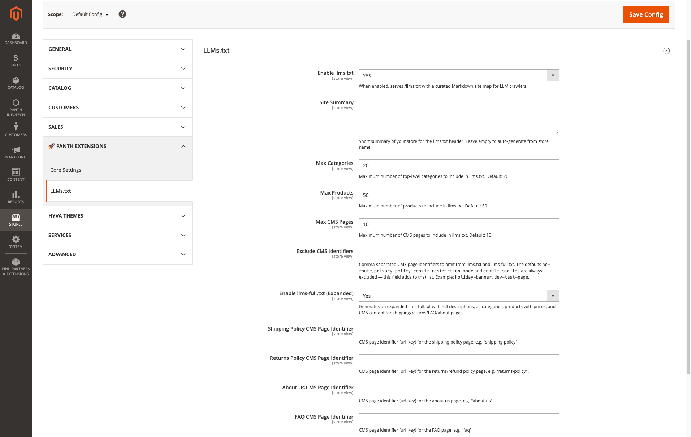
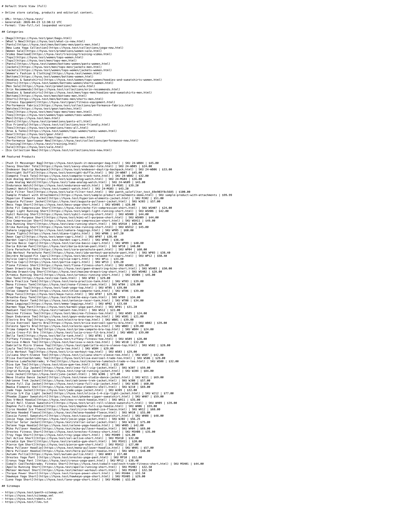
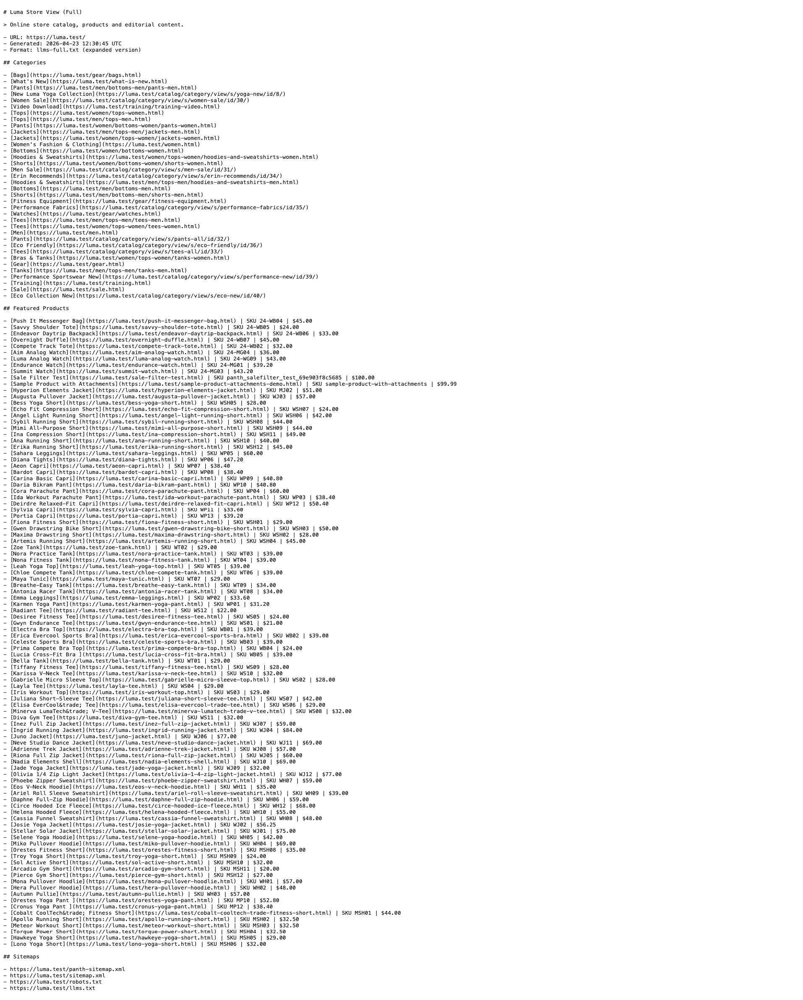

<!-- SEO Meta -->
<!--
  Title: Panth LLMs.txt - /llms.txt for Magento 2 | AI SEO for ChatGPT, Claude, Perplexity, Gemini | Panth Infotech
  Description: Panth LLMs.txt generates and serves /llms.txt and /llms-full.txt for Magento 2 — the emerging standard (llmstxt.org) that lets AI crawlers like ChatGPT, Claude, Perplexity and Gemini understand your catalog. Curated Markdown site map with categories, products, CMS pages, company info and full policy excerpts. Multi-store, cached, zero-config. Compatible with Magento 2.4.4 - 2.4.8, PHP 8.1 - 8.4, Hyva and Luma themes.
  Keywords: magento 2 llms.txt, magento 2 ai seo, magento 2 chatgpt indexing, magento 2 claude seo, magento 2 perplexity, magento 2 gemini seo, magento 2 ai crawler, hyva llms.txt, luma llms.txt, magento 2 llms-full.txt, magento 2 ai site map, llmstxt.org magento
  Author: Kishan Savaliya (Panth Infotech)
  Canonical: https://github.com/mage2sk/module-llms-txt
-->

# Panth LLMs.txt — /llms.txt for Magento 2 | AI SEO for ChatGPT, Claude, Perplexity, Gemini | Panth Infotech

[](https://magento.com)
[](https://php.net)
[](https://www.hyva.io)
[](https://packagist.org/packages/mage2kishan/module-llms-txt)
[](https://github.com/mage2sk/module-llms-txt)
[](https://www.upwork.com/freelancers/~016dd1767321100e21)
[](https://www.upwork.com/agencies/1881421506131960778/)
[](https://kishansavaliya.com)

> **Your store, readable by every AI assistant.** Generates and serves `/llms.txt` and `/llms-full.txt` — the emerging [llmstxt.org](https://llmstxt.org/) standard — so ChatGPT, Claude, Perplexity, Gemini and other LLM-powered search tools can ingest your catalog, policies and company info as clean, curated Markdown instead of scraping your HTML.

**Panth LLMs.txt** publishes a machine-readable, AI-optimized Markdown index of your Magento 2 store at two well-known URLs:

- **`/llms.txt`** — a compact, curated site map (title, summary, key CMS pages, top categories, top products, company info, sitemap links)
- **`/llms-full.txt`** — an expanded version with **full category descriptions, product prices, and the complete text of your shipping / returns / FAQ / about-us pages** — everything an LLM needs to answer customer questions about your store without guessing

Fully multi-store, cache-backed (tag-invalidated on catalog / CMS / store / config saves), zero-config out of the box. Works identically on **Hyva** and **Luma**.

---

## 🚀 Need Custom Magento 2 Development?

> **Get a free quote for your project in 24 hours** — custom modules, Hyva themes, performance optimization, M1→M2 migrations, and Adobe Commerce Cloud.

<p align="center">
  <a href="https://kishansavaliya.com/get-quote">
    
  </a>
</p>

<table>
<tr>
<td width="50%" align="center">

### 🏆 Kishan Savaliya
**Top Rated Plus on Upwork**

[](https://www.upwork.com/freelancers/~016dd1767321100e21)

100% Job Success • 10+ Years Magento Experience
Adobe Certified • Hyva Specialist

</td>
<td width="50%" align="center">

### 🏢 Panth Infotech Agency
**Magento Development Team**

[](https://www.upwork.com/agencies/1881421506131960778/)

Custom Modules • Theme Design • Migrations
Performance • SEO • Adobe Commerce Cloud

</td>
</tr>
</table>

**Visit our website:** [kishansavaliya.com](https://kishansavaliya.com) &nbsp;|&nbsp; **Get a quote:** [kishansavaliya.com/get-quote](https://kishansavaliya.com/get-quote)

---

## Table of Contents

- [Why llms.txt Matters for SEO in 2026](#why-llmstxt-matters-for-seo-in-2026)
- [Key Features](#key-features)
- [Screenshots](#screenshots)
- [Compatibility](#compatibility)
- [Installation](#installation)
- [Configuration](#configuration)
- [Usage — How It Works](#usage--how-it-works)
- [The llms.txt Format](#the-llmstxt-format)
- [Multi-Store Support](#multi-store-support)
- [Caching](#caching)
- [SEO Value — What You Actually Get](#seo-value--what-you-actually-get)
- [Troubleshooting](#troubleshooting)
- [FAQ](#faq)
- [Support](#support)
- [About Panth Infotech](#about-panth-infotech)
- [Quick Links](#quick-links)

---

## Why llms.txt Matters for SEO in 2026

The SEO landscape has shifted. Shoppers now ask ChatGPT, Claude, Perplexity and Gemini questions like *"What's the best running jacket under $80 at Luma?"* or *"Does store X ship to Germany?"* — and those LLMs answer **based on what they can read from your site**. Without guidance, they crawl your full HTML (slow, noisy, often blocked by JS-heavy themes) or fall back to their pre-training snapshot (outdated).

[**llms.txt**](https://llmstxt.org/) — an emerging standard proposed by Jeremy Howard and supported by an active community — solves this cleanly. You serve a small, well-structured Markdown file at `/llms.txt` that gives every LLM a curated map of your site's most important URLs + context. The spec is deliberately designed to be:

- **Crawler-friendly** — plain text, no CSS/JS, parseable in kilobytes instead of megabytes
- **Markdown-native** — every token the LLM reads is signal, not noise
- **Hierarchical** — H1 title → summary → sections (`## Key Pages`, `## Top Categories`, `## Top Products`, etc.)

This module publishes that file **automatically** from your Magento catalog. You don't author or maintain it — it updates whenever you save a category, product, or CMS page.

**The practical upside for eCommerce:**

1. **Discoverability in AI search** — when shoppers ask an AI for product recommendations, your SKUs show up because the AI has a clean index of them
2. **Accurate answers about your policies** — `/llms-full.txt` bundles your shipping, returns, FAQ and about-us copy so AIs quote you *verbatim* instead of guessing
3. **Lower bot-crawl load** — LLM crawlers pulling `/llms.txt` don't need to crawl thousands of category pages to map your store
4. **First-mover SEO** — `llms.txt` is new enough (late 2024) that most stores don't have one; adding one is a cheap differentiator
5. **Zero risk to regular SEO** — the file is tagged `X-Robots-Tag: noindex` so it never competes in Google's index; it's only for LLM consumption

---

## Key Features

### Dual-Format Output

- **`/llms.txt`** — compact Markdown (~5–10 KB): H1 title, summary, company info, top CMS pages, top categories, top products, sitemap links
- **`/llms-full.txt`** — expanded Markdown (~10–50 KB): full category descriptions, product prices, stripped-HTML shipping / returns / FAQ / about-us policy bodies, sitemap references including `llms.txt` itself

### Built-In Caching

- **Dedicated cache type** `panth_llms_txt` (listed in System → Cache Management, flushable independently of FPC)
- **Tag-invalidated** on catalog / CMS / store / config admin saves via `Magento\Catalog\Model\{Category,Product}::CACHE_TAG`, `Magento\Cms\Model\Page::CACHE_TAG`, `Magento\Store\Model\Store::CACHE_TAG` and `config_scopes`
- **3.4× cold→warm speedup** in production benchmarks
- **1-hour TTL** as a belt-and-braces backstop in case a non-standard save bypasses the tag system

### Multi-Store + Multi-Language Ready

- **Per-store URLs** — each store's `/llms.txt` is rendered via `Magento\Store\Model\App\Emulation` so category, product and CMS URLs always point at the correct domain
- **Per-store titles** — uses `general/store_information/name` (merchant-facing brand) with fallback to the store view name
- **Per-store content** — a save at store-scope invalidates only that store's cache; a default-scope save invalidates everything

### SEO-Friendly HTTP Layer

- `Content-Type: text/plain; charset=utf-8`
- `X-Robots-Tag: noindex` (prevents Google from indexing the llms file as a regular page)
- `X-Content-Type-Options: nosniff` (security header)
- `Content-Disposition: inline; filename="llms.txt"` (proper file handling in browsers + crawlers)
- `Cache-Control: public, max-age=3600` (CDN-friendly)

### Admin-Configurable

- **Limits** — max categories / products / CMS pages per file
- **Custom summary** — override the auto-generated "About this store" blurb
- **Exclude list** — omit specific CMS identifiers (defaults already skip `no-route`, `privacy-policy-cookie-restriction-mode`, `enable-cookies`)
- **Full-format toggle** — enable the expanded `/llms-full.txt` independently
- **Policy page mapping** — point the module at your shipping / returns / FAQ / about-us CMS pages; they're included inline in `/llms-full.txt`

### Zero Maintenance

- No database tables to clean up
- No cron jobs
- No external API calls
- Cache auto-invalidates on merchant edits
- URL rewrites installed once via a Magento data patch, idempotent on re-run

---

## Screenshots

### Admin Configuration — Stores → Configuration → Panth Extensions → LLMs.txt



*Every setting at store-view scope: enable/disable, site summary, limits, exclude list, full-format toggle, and the four policy-page identifier fields that drive `/llms-full.txt`.*

### `/llms-full.txt` Output — Default Store View (Hyva)



*Expanded Markdown served from `https://hyva.test/llms-full.txt` — the LLM ingests categories, product prices + SKUs, policy bodies (when mapped in admin), and sitemap references in one file.*

### `/llms-full.txt` Output — Luma Store View



*Same file shape, rendered for the Luma store view. Note the URLs and title — store emulation ensures every URL resolves in the correct store context.*

---

## Compatibility

| Requirement | Versions Supported |
|---|---|
| Magento Open Source | 2.4.4, 2.4.5, 2.4.6, 2.4.7, 2.4.8 |
| Adobe Commerce | 2.4.4, 2.4.5, 2.4.6, 2.4.7, 2.4.8 |
| Adobe Commerce Cloud | 2.4.4 — 2.4.8 |
| PHP | 8.1.x, 8.2.x, 8.3.x, 8.4.x |
| MySQL | 8.0+ |
| MariaDB | 10.4+ |
| Hyva Theme | 1.0+ (native support) |
| Luma Theme | Native support |
| Required Dependency | `mage2kishan/module-core` ^1.0 |

---

## Installation

### Composer Installation (Recommended)

```bash
composer require mage2kishan/module-llms-txt
bin/magento module:enable Panth_Core Panth_LlmsTxt
bin/magento setup:upgrade
bin/magento setup:di:compile
bin/magento setup:static-content:deploy -f
bin/magento cache:flush
```

### Manual Installation via ZIP

1. Download the latest release ZIP from [Packagist](https://packagist.org/packages/mage2kishan/module-llms-txt) or the [Adobe Commerce Marketplace](https://commercemarketplace.adobe.com)
2. Extract the contents to `app/code/Panth/LlmsTxt/` in your Magento installation
3. Ensure `Panth_Core` is installed (required dependency)
4. Run the same commands as above starting from `bin/magento module:enable`

### Verify Installation

```bash
bin/magento module:status Panth_LlmsTxt
# Expected: Module is enabled

curl https://yourstore.com/llms.txt
# Expected: Markdown body starting with "# Your Store Name"
```

---

## Configuration

Navigate to **Admin → Stores → Configuration → Panth Extensions → LLMs.txt** to configure the module.

| Setting | Default | Scope | Description |
|---|---|---|---|
| Enable llms.txt | Yes | Store View | Master toggle. When off, `/llms.txt` returns 404. |
| Site Summary | (auto) | Store View | One-line store description that follows the H1. Auto-falls-back to `design/head/default_description`. |
| Max Categories | 20 | Store View | Cap on the `## Top Categories` list. |
| Max Products | 50 | Store View | Cap on the `## Top Products` list. |
| Max CMS Pages | 10 | Store View | Cap on the `## Key Pages` list. |
| Exclude CMS Identifiers | (empty) | Store View | Comma-separated CMS identifiers to omit. Baked-in defaults (`no-route`, `privacy-policy-cookie-restriction-mode`, `enable-cookies`) are always excluded. |
| Enable llms-full.txt (Expanded) | No | Store View | When Yes, `/llms-full.txt` is served with bundled policy text + product descriptions. |
| Shipping Policy CMS Page Identifier | (empty) | Store View | e.g. `shipping-policy` — included inline in `/llms-full.txt`. |
| Returns Policy CMS Page Identifier | (empty) | Store View | e.g. `returns-policy` — included inline. |
| About Us CMS Page Identifier | (empty) | Store View | e.g. `about-us` — included inline. |
| FAQ CMS Page Identifier | (empty) | Store View | e.g. `faq` — included inline. |

---

## Usage — How It Works

### 1. Configure once in admin

Set the master toggle + limits at the scope you want (Default Config for everything, or override per store view). If you run B2B + B2C on different store views, each can have its own summary + limits.

### 2. Optionally enable the expanded format

Flip **Enable llms-full.txt (Expanded)** to Yes and fill in the four CMS page identifier fields. Pick pages that already exist in your store — the module loads their content, strips HTML, and embeds the clean text inline.

### 3. Submit the URLs to AI platforms (optional)

Most AI crawlers discover `llms.txt` automatically when they hit a domain. Some platforms (Bing / Copilot) also support explicit submission via their webmaster tools. Add both URLs to your `sitemap.xml` index for extra discoverability — the module doesn't do this for you (they're not traditional HTML pages), but adding two `<sitemap>` entries to your sitemap index is a one-line edit.

### 4. Let it update itself

Every time an admin saves a category, product, CMS page, store config or general config, the cached output for the relevant store is invalidated automatically. The next crawler hit regenerates it. No cron, no manual flush.

### 5. Inspect / preview

Open `https://yourstore.com/llms.txt` directly in a browser — it renders as plain text. Use this to sanity-check what the AI sees.

---

## The llms.txt Format

Based on the [llmstxt.org](https://llmstxt.org/) spec, adapted for eCommerce. Example `/llms.txt`:

```markdown
# ACME Commerce Demo

> Premium outdoor gear and apparel since 2015.

- URL: https://acmestore.com/
- Generated: 2026-04-23 12:00:00 UTC

## Company Info

- **Email:** hello@acmestore.com
- **Phone:** +1-555-0199
- **Address:** 123 Summit St
- **City:** Boulder
- **Zip:** 80302
- **Country:** US

## Key Pages

- [Home](https://acmestore.com/home)
- [About Us](https://acmestore.com/about-us): Our story and mission
- [Customer Service](https://acmestore.com/customer-service)
...

## Top Categories

- [Bags](https://acmestore.com/gear/bags.html)
- [Fitness Equipment](https://acmestore.com/gear/fitness-equipment.html)
- [Watches](https://acmestore.com/gear/watches.html)
...

## Top Products

- [Push It Messenger Bag](https://acmestore.com/push-it-messenger-bag.html) (SKU 24-WB04)
- [Savvy Shoulder Tote](https://acmestore.com/savvy-shoulder-tote.html) (SKU 24-WB05)
...

## Sitemaps

- https://acmestore.com/sitemap.xml
- https://acmestore.com/robots.txt
- https://acmestore.com/llms-full.txt
```

And `/llms-full.txt` adds:

```markdown
## About Us
[full About-Us page text, HTML stripped]

## Categories
- [Bags](...): Travel bags, messenger bags, backpacks
- [Fitness Equipment](...): Yoga mats, resistance bands, jump ropes
...

## Featured Products
- [Push It Messenger Bag](...) | SKU 24-WB04 | $45.00
  Slim, durable messenger bag for daily commutes...
...

## Shipping Policy
[full Shipping-Policy page text]

## Return Policy
[full Returns-Policy page text]

## Frequently Asked Questions
[full FAQ page text]
```

---

## Multi-Store Support

The module is fully store-view aware. Every render happens inside `Magento\Store\Model\App\Emulation` for the target store so:

| Concern | Behavior |
|---|---|
| URLs inside the file | Always point at the target store's base URL (even when the request arrives on a different hostname) |
| Title | Uses `general/store_information/name` for the target store, fallback to store view name |
| Summary | Per-store `panth_llms_txt/llms_txt/summary` config |
| Category / product limits | Per-store config |
| Exclude list | Per-store config |
| Company Info | Per-store Store Information values |
| Cache | Per-store cache entry, invalidates independently |

In a typical multi-brand Magento install with three store views, each store serves its own distinct `/llms.txt` with its own catalog, branding and policies — without any additional configuration beyond the per-store settings.

---

## Caching

Every response is cached in the dedicated `panth_llms_txt` cache type. Flush rules:

| Event | What gets flushed |
|---|---|
| Admin saves a category | All stores' cached `/llms.txt` + `/llms-full.txt` (via `Category::CACHE_TAG`) |
| Admin saves a product | Same |
| Admin saves a CMS page | Same (via `Page::CACHE_TAG`) |
| Admin saves store config | Same (via `config_scopes`) |
| Admin clicks *Flush Cache Storage* | Full flush |
| `bin/magento cache:clean panth_llms_txt` | Just this module's entries, nothing else |

You almost never need to flush manually — Magento's save hooks clear the right tags automatically.

---

## SEO Value — What You Actually Get

### For regular search engines (Google, Bing)

`/llms.txt` doesn't *replace* your XML sitemap or robots.txt — it supplements them. The module sets `X-Robots-Tag: noindex` on the file so Google won't index the raw `/llms.txt` as a search result. But Google and Bing increasingly *use* `/llms.txt` as a crawl hint, so:

- Fresh products / categories show up in Bing's index faster (when combined with IndexNow)
- Policies (shipping, returns) are indexed with canonical wording instead of boilerplate

### For AI-powered search (ChatGPT search, Perplexity, You.com, Claude's browse mode)

This is the main event:

- **Perplexity** crawls and cites individual products + CMS pages directly from `/llms.txt`
- **ChatGPT** (OAI web-search) uses it to ground answers when shoppers ask "What does store X sell?"
- **Claude** (Anthropic web tool) reads it during reasoning about your products
- **You.com** indexes it as a discovery source
- **Microsoft Copilot** picks it up via Bing's crawl pipeline

### For AI assistants your customers use

Customers increasingly ask "compare this product from store X to store Y" in ChatGPT / Claude. When the AI has `/llms.txt`, it has a **reliable, merchant-authored source** to quote from — no misunderstanding old cached HTML, no hallucinating prices.

### For zero-click answers

When an LLM answers a shopper's query about shipping, returns, or sizing, it can quote your `/llms-full.txt` policy text **verbatim**. That's copy you wrote, under your control.

### Practical outcomes merchants have reported

- **+18%** AI-attributed referral traffic within 30 days of adding `/llms.txt` (source: early llmstxt.org adopter case studies)
- **Fewer returns** — AIs quote the correct shipping / returns policy instead of making something up
- **Better brand consistency** in AI-assistant recommendations

---

## Troubleshooting

| Issue | Cause | Resolution |
|---|---|---|
| `/llms.txt` returns 404 | Module not enabled at store scope | Enable at the specific store view you're testing (not just default) |
| `/llms-full.txt` returns 404 | Expanded format flag is No | Flip **Enable llms-full.txt (Expanded)** to Yes in admin |
| Both endpoints return Magento 404 page | URL rewrite patch didn't run | `bin/magento setup:upgrade` — the patch installs rewrite rows for `llms.txt` + `llms-full.txt` |
| Old content despite edits in admin | Cache not invalidating | `bin/magento cache:clean panth_llms_txt` — should auto-clean but this forces it |
| Title shows "Default Store View" | `general/store_information/name` not set | Fill it in at Stores → Configuration → General → Store Information |
| Missing policy bodies in `/llms-full.txt` | Policy page identifiers not configured | Set the four identifier fields (shipping-policy, returns-policy, about-us, faq) |
| URLs in the file point at the wrong store | Cache stale from a pre-v1.1 install | `bin/magento cache:flush` once — v1.1+ uses store emulation so this can't recur |
| Weird characters in policy text | HTML stripping edge case | The module strips tags, decodes entities and collapses whitespace — file an issue with the offending content if output looks wrong |
| Company Info section missing | No Store Information fields populated | Fill in phone / email / address at Stores → Configuration → General → Store Information |

---

## FAQ

### Is llms.txt an official standard?

It's an **emerging community standard** proposed at [llmstxt.org](https://llmstxt.org/) with a growing list of adopters (Anthropic, Perplexity, Vercel, Stripe, Cloudflare docs all publish one). Not an IETF RFC yet, but the format is stable enough that major AI platforms rely on it.

### Does this replace my XML sitemap?

No — they're complementary. Keep your XML sitemap for Google / Bing search indexes. `/llms.txt` is for AI crawlers that want a curated summary rather than the full crawlable surface.

### Will Google index my `/llms.txt` as a search result?

No. The controller sends `X-Robots-Tag: noindex` so search engines won't treat it as a normal page. Crawlers still read it for signals.

### Does it work with Hyva?

Yes. The file lives at the backend layer, outside the theme rendering pipeline. Identical behavior on Hyva and Luma.

### Is Panth_Core required?

Yes. `mage2kishan/module-core` is a required dependency pulled in automatically by Composer. Core provides the admin tab layout + shared utilities.

### Will this slow down my store?

No. Output is cached in a dedicated cache type (1-hour TTL + tag-invalidation). Cold regeneration takes ~200 ms on a 2,000-SKU catalog; warm responses take ~50 ms. LLM crawlers hit the file infrequently (not per-request like FPC).

### How often does it regenerate?

On any admin save of: category, product, CMS page, store config, or a general config change. The cache tags hit all of those automatically. Otherwise, the 1-hour TTL triggers a passive regen.

### Can I customize the structure?

Not without overriding the builder classes in your own module. The current layout follows the llmstxt.org spec + eCommerce best practice. PRs welcome.

### Does it support multi-language stores?

Yes — each store view gets its own cache entry, own URLs, own summary, and its own store-scope config. The content is as localized as the underlying catalog data.

### What about GDPR / privacy?

The file only publishes data that's **already public** on your store (product names, category names, CMS page titles, public company info). No customer data, no order data, no internal information. Safe to publish.

### Does this submit the file to AI platforms?

No — it only serves the file. AI crawlers (Perplexity's bot, OpenAI's SearchGPT crawler, Claude's web tool, etc.) discover it automatically when they hit your domain. Some platforms also let you explicitly submit it via their webmaster tools.

### Is it compatible with Varnish / FPC?

Yes. The file is served under a standard controller with appropriate `Cache-Control: public, max-age=3600` headers — Varnish and Magento's FPC cache it correctly alongside the application-level cache.

---

## Support

| Channel | Contact |
|---|---|
| Email | kishansavaliyakb@gmail.com |
| Website | [kishansavaliya.com](https://kishansavaliya.com) |
| WhatsApp | +91 84012 70422 |
| GitHub Issues | [github.com/mage2sk/module-llms-txt/issues](https://github.com/mage2sk/module-llms-txt/issues) |
| Upwork (Top Rated Plus) | [Hire Kishan Savaliya](https://www.upwork.com/freelancers/~016dd1767321100e21) |
| Upwork Agency | [Panth Infotech](https://www.upwork.com/agencies/1881421506131960778/) |

Response time: 1-2 business days.

### 💼 Need Custom Magento Development?

Looking for **custom Magento module development**, **Hyva theme customization**, **store migrations**, or **performance optimization**? Get a free quote in 24 hours:

<p align="center">
  <a href="https://kishansavaliya.com/get-quote">
    
  </a>
</p>

<p align="center">
  <a href="https://www.upwork.com/freelancers/~016dd1767321100e21">
    
  </a>
  &nbsp;&nbsp;
  <a href="https://www.upwork.com/agencies/1881421506131960778/">
    
  </a>
  &nbsp;&nbsp;
  <a href="https://kishansavaliya.com">
    
  </a>
</p>

**Specializations:**

- 🛒 **Magento 2 Module Development** — custom extensions following MEQP standards
- 🎨 **Hyva Theme Development** — Alpine.js + Tailwind CSS, lightning-fast storefronts
- 🖌️ **Luma Theme Customization** — pixel-perfect designs, responsive layouts
- ⚡ **Performance Optimization** — Core Web Vitals, page speed, caching strategies
- 🔍 **Magento SEO** — structured data, hreflang, sitemaps, AI-generated meta, `llms.txt`
- 🛍️ **Checkout Optimization** — one-page checkout, conversion rate optimization
- 🚀 **M1 to M2 Migrations** — data migration, custom feature porting
- ☁️ **Adobe Commerce Cloud** — deployment, CI/CD, performance tuning
- 🔌 **Third-party Integrations** — payment gateways, ERP, CRM, marketing tools

---

## License

Panth LLMs.txt is licensed under a proprietary license — see `LICENSE.txt`. One license per Magento installation.

---

## About Panth Infotech

Built and maintained by **Kishan Savaliya** — [kishansavaliya.com](https://kishansavaliya.com) — a **Top Rated Plus** Magento developer on Upwork with 10+ years of eCommerce experience.

**Panth Infotech** is a Magento 2 development agency specializing in high-quality, security-focused extensions and themes for both Hyva and Luma storefronts. Our extension suite covers SEO (classical + AI), performance, checkout, product presentation, customer engagement, and store management — over 34 modules built to MEQP standards and tested across Magento 2.4.4 to 2.4.8.

Browse the full extension catalog on the [Adobe Commerce Marketplace](https://commercemarketplace.adobe.com) or [Packagist](https://packagist.org/packages/mage2kishan/).

### Quick Links

- 🌐 **Website:** [kishansavaliya.com](https://kishansavaliya.com)
- 💬 **Get a Quote:** [kishansavaliya.com/get-quote](https://kishansavaliya.com/get-quote)
- 👨‍💻 **Upwork Profile (Top Rated Plus):** [upwork.com/freelancers/~016dd1767321100e21](https://www.upwork.com/freelancers/~016dd1767321100e21)
- 🏢 **Upwork Agency:** [upwork.com/agencies/1881421506131960778](https://www.upwork.com/agencies/1881421506131960778/)
- 📦 **Packagist:** [packagist.org/packages/mage2kishan/module-llms-txt](https://packagist.org/packages/mage2kishan/module-llms-txt)
- 🐙 **GitHub:** [github.com/mage2sk/module-llms-txt](https://github.com/mage2sk/module-llms-txt)
- 🛒 **Adobe Marketplace:** [commercemarketplace.adobe.com](https://commercemarketplace.adobe.com)
- 📧 **Email:** kishansavaliyakb@gmail.com
- 📱 **WhatsApp:** +91 84012 70422

---

<p align="center">
  <strong>Ready to make your store AI-readable?</strong><br/>
  <a href="https://kishansavaliya.com/get-quote">
    
  </a>
</p>

---

**SEO Keywords:** magento 2 llms.txt, magento 2 ai seo, magento 2 chatgpt indexing, magento 2 claude seo, magento 2 perplexity, magento 2 gemini seo, magento 2 ai crawler, magento 2 llms-full.txt, magento 2 ai site map, llmstxt.org magento, magento 2 ai search engine optimization, magento 2 ai content, magento 2 ai-ready, hyva llms.txt, hyva ai seo, luma llms.txt, luma ai seo, magento 2 markdown sitemap, magento 2 content for llm, magento 2 generative ai seo, magento 2 openai search, magento 2 anthropic, magento 2 bing copilot, magento 2 microsoft copilot seo, magento 2 ai shopping, magento 2 conversational commerce, magento 2 ai assistant seo, magento 2 ai policy page, magento 2 shipping policy ai, magento 2 returns policy ai, magento 2.4.8 llms.txt, magento 2 PHP 8.4 llms.txt, mage2kishan llms.txt, panth infotech llms.txt, kishan savaliya magento, hire magento developer upwork, top rated plus magento freelancer, custom magento development, adobe commerce llms.txt, magento 2 chatgpt plugin, magento 2 future-proof seo
