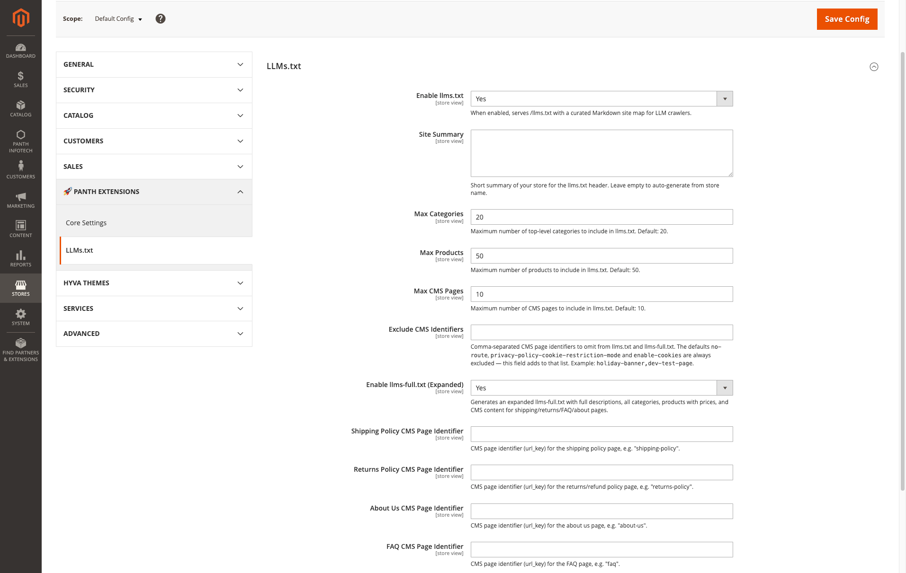
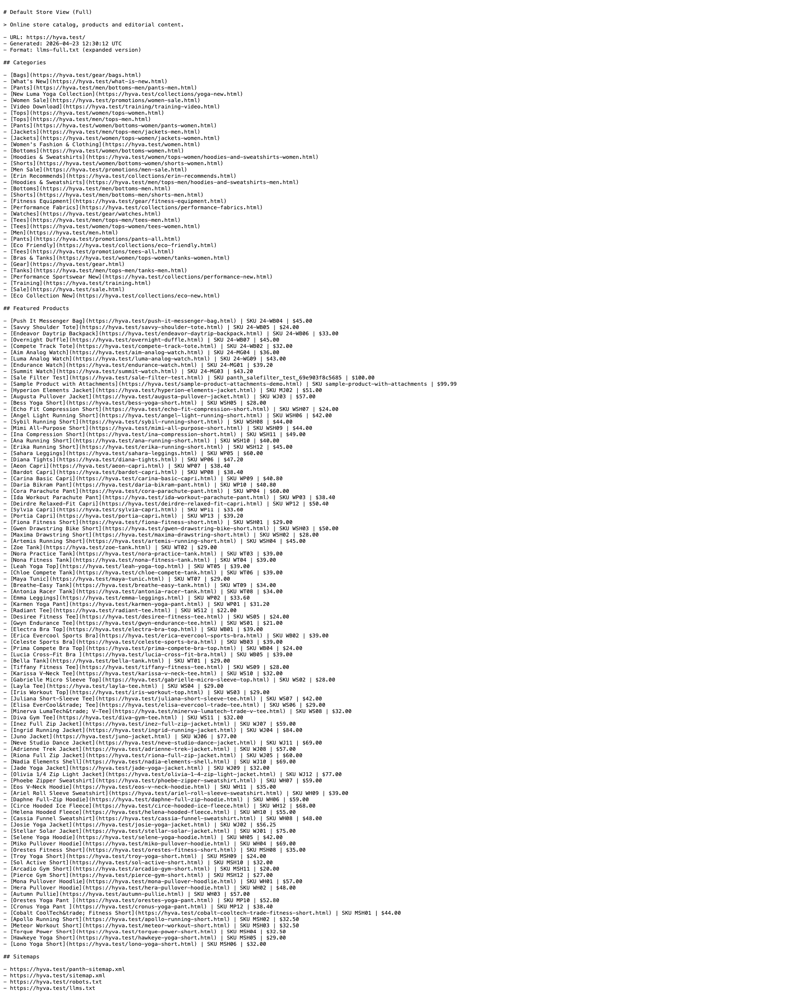

# Magento 2 LLMs.txt

Panth LLMs.txt serves three generated index documents from a Magento 2 store: `/llms.txt` (a Markdown site map following the proposal at llmstxt.org), `/llms-full.txt` (the same content plus the bodies of selected CMS policy pages) and `/llms.json` (the same data as JSON). The documents are built from the store's categories, CMS pages, products, store information and XML sitemaps, cached per store view, and refreshed when catalog, CMS or configuration data changes.

The audience for these files is LLM crawlers and AI assistants such as ChatGPT, Claude, Perplexity and Gemini. The module adds three URL rewrites and a frontend controller; it does not change any storefront page. Because the output is served by a controller with no layout or template, it behaves the same on Hyva and Luma themes. It is used by merchants and developers who want a curated, store-scoped description of the catalog available at a well-known URL.

Product page: [kishansavaliya.com/magento-2-llms-txt.html](https://kishansavaliya.com/magento-2-llms-txt.html)

## Features

- Serves `/llms.txt`, `/llms-full.txt` and `/llms.json` per store view through URL rewrites installed by data patches.
- `llms.txt` Markdown sections, in render order: store header and summary, Store Overview, Company, Priority URLs, Collections, Key Pages, Category Tree, Product Types, Use Cases, Featured Products, Best Sellers, Recent Arrivals, optional Testimonials / FAQs / Forms, Sitemap Highlights and Index Formats.
- `llms-full.txt` adds the text of the About Us, Shipping Policy, Return Policy and FAQ CMS pages (HTML stripped, CMS directives processed) under their own headings.
- `llms.json` (schema `panth.llms_txt/v1`) contains store and company data, ranked sections (`priority_urls`, `collections`, `key_pages`, `categories`, `featured_products`, `bestsellers`, `recent_arrivals`, and `testimonials`, `faqs`, `forms` when available) and the ranked sitemap entries with their source URLs.
- Store summary is taken from configuration, otherwise generated from the product count, top-level categories and currency, otherwise from `design/head/default_description`.
- Category tree limited to a configurable depth (1 to 5), only active categories that are included in the menu under the store root.
- Key Pages lists active CMS pages for the store, newest updated first, with built-in exclusions for `no-route`, `privacy-policy-cookie-restriction-mode` and `enable-cookies`; truncation is logged.
- Curated product sections: Featured Products (Yes/No attribute, default `is_featured`), Best Sellers (by total quantity ordered, see below) and Recent Arrivals (by `created_at`). Each product line carries name, URL, final price converted to the store view's display currency, SKU, first category and an optional one-line description resolved from `short_description`, `meta_description` or the first sentence of `description`.
- Sitemap engine: fetches one or more configured sitemap URLs (or `{baseUrl}sitemap.xml`), handles `<urlset>` and one level of `<sitemapindex>`, gzip-encoded bodies, per-request timeout, an entry cap and a separate cache TTL. Requests are limited to the hosts of the Magento store base URLs and the hosts of configured sitemap URLs that resolve only to public IP addresses; nested sitemaps and redirects to any other host are skipped.
- Weighted ranking: each index entry is scored 0.0 to 1.0 from configurable type weights, sitemap priority, bestseller rank and featured flag; pinned URLs and wildcard path prefixes override the score; entries below the minimum score are dropped and each section is capped.
- Use-case buckets map a shopper intent label to category IDs with an optional summary line.
- Product Types block with counts per Magento product type.
- Optional sections for Panth_Testimonials, Panth_Faq and Panth_DynamicForms data, rendered only when those modules' tables exist.
- Dedicated cache type `panth_llms_txt` (label "Panth LLMs.txt" in System > Cache Management) with a one-hour lifetime, invalidated by category, product, CMS page, store and configuration cache tags.
- Optional daily cron job that regenerates all three documents and refreshes the sitemap cache for every enabled store view.
- Responses send `Content-Type`, `X-Robots-Tag: noindex`, `X-Content-Type-Options: nosniff`, `Cache-Control: public, max-age=3600` and an inline `Content-Disposition`; controllers answer both GET and HEAD.
- A sample nginx snippet (`etc/nginx.conf.sample`) answers HEAD requests for the friendly URLs directly from nginx.
- Store emulation wraps every render so URLs, prices and locale resolve for the requested store view.
- Settings are available at default, website and store view scope.
- Data patch migrates configuration saved under the legacy `panth_seo/llms_txt/*` paths to `panth_llms_txt/llms_txt/*`.

## Compatibility

| Platform | Versions |
|---|---|
| Magento Open Source | 2.4.4 to 2.4.8 |
| Adobe Commerce | 2.4.4 to 2.4.8 |
| PHP | 8.1, 8.2, 8.3, 8.4 |
| Themes | Hyva, Luma (output is served by a controller and does not depend on the theme) |

Composer constraints on Magento packages: `magento/framework ^103.0`, `magento/module-store ^101.1`, `magento/module-catalog ^104.0`, `magento/module-cms ^104.0`, `magento/module-url-rewrite ^102.0`, `magento/module-config ^101.2`.

## Requirements

- Magento Open Source or Adobe Commerce 2.4.4 to 2.4.8
- PHP `~8.1.0 || ~8.2.0 || ~8.3.0 || ~8.4.0`
- `mage2kishan/module-core` `^1.0` (installed automatically by Composer; provides the shared "Panth Extensions" configuration tab)
- Magento modules loaded before this one (from `etc/module.xml`): Panth_Core, Magento_Catalog, Magento_Cms, Magento_UrlRewrite, Magento_Cron, Magento_Sales
- Optional: Panth_Testimonials, Panth_Faq and Panth_DynamicForms. When present, their public pages can be included in the output; when absent, the related settings have no effect.

## Installation

```bash
composer require mage2kishan/module-llms-txt
bin/magento module:enable Panth_Core Panth_LlmsTxt
bin/magento setup:upgrade
bin/magento setup:di:compile
bin/magento cache:flush
```

`setup:di:compile` is only needed in production mode. The module ships no files under `view/*/web`, so `setup:static-content:deploy` is not required.

`setup:upgrade` runs the data patches that insert the `llms.txt`, `llms-full.txt` and `llms.json` URL rewrites for every store view and migrate legacy configuration paths.

Check the result:

```bash
bin/magento module:status Panth_LlmsTxt
curl -s "<store-base-url>/llms.txt" | head -20
```

## Configuration

Admin path: Stores > Configuration > Panth Extensions > LLMs.txt. Every field can be set at default, website or store view scope. Configuration section id: `panth_llms_txt`.



### General (`panth_llms_txt/llms_txt/*`)

| Setting | Default | What it does |
|---|---|---|
| Enable llms.txt (`enabled`) | Yes | Serves `/llms.txt`. When No, the URL returns 404 with a short plain-text notice. |
| Site Summary (`summary`) | empty | One-line summary printed under the title in all three documents. Blank means auto-generated from product count, top categories and currency, then `design/head/default_description`. Shown when enabled. |
| Priority URLs (`priority_urls`) | empty | One entry per line as `Label \| /path` or `/path` (label derived from the last path segment). Rendered under "## Priority URLs". Shown when enabled. |
| Collections (Category IDs) (`collections_categories`) | empty | Comma-separated category IDs rendered under "## Collections" as curated landing pages. Shown when enabled. |

### Sitemap Engine (`panth_llms_txt/sitemap/*`)

| Setting | Default | What it does |
|---|---|---|
| Sitemap URLs (`urls`) | empty | One absolute or relative sitemap URL per line; lines starting with `#` are ignored. Relative URLs are resolved against the store base URL. Absolute URLs must use http or https, must not contain credentials, and must either use one of the store domains or a host whose DNS records resolve only to public IP addresses (no loopback, private, link-local or reserved ranges, IPv4 or IPv6); otherwise the configuration is not saved and the error names the rejected URL. The host of each accepted absolute URL is added to the list of hosts the fetcher may contact. |
| Auto-detect Default Sitemap (`auto`) | Yes | When the list above is empty, use `{baseUrl}sitemap.xml`. |
| Render "Sitemap Highlights" Section (`render_section`) | Yes | Lists the highest-scored sitemap rows under "## Sitemap Highlights" in `llms.txt` and `llms-full.txt`. |
| Max Rendered Sitemap Rows (`max_rendered`) | 50 | Cap on rows rendered in that section. Shown when the section is enabled. |
| Max Parsed Sitemap Entries (`max_entries`) | 5000 | Upper bound on entries loaded across all configured sitemaps. |
| Per-request Timeout (seconds) (`timeout`) | 8 | Connect and read timeout per sitemap request (clamped to 1 to 60). |
| Sitemap Cache TTL (seconds) (`ttl`) | 3600 | Lifetime of the parsed sitemap cache (minimum 60). |

### Weighting & Ranking (`panth_llms_txt/weighting/*`)

| Setting | Default | What it does |
|---|---|---|
| Type Weights (`type_weights`) | empty | `code=weight` per line for `homepage`, `category`, `collection`, `product`, `cms`, `sitemap`, `external`. Built-in defaults: homepage 1.0, collection 0.85, category 0.75, cms 0.65, product 0.55, sitemap 0.45, external 0.40. |
| Pinned URLs (`pinned_urls`) | empty | `url_or_path=score` per line; a trailing `*` pins a whole path prefix (for example `/sale/*=1.0`). Pinned scores override all other signals. |
| Minimum Score (`min_score`) | 0.20 | Entries scoring below this value are dropped. |
| Max Entries Per Section (`max_entries_per_section`) | 200 | Cap applied to each ranked section after sorting. |

### Content Limits (stored under `panth_llms_txt/llms_txt/*`)

| Setting | Default | What it does |
|---|---|---|
| Max Category Tree Depth (`max_category_depth`) | 3 | Levels of the category tree to include (1 to 5). |
| Max CMS Pages (`max_cms`) | 100 | Maximum pages under "## Key Pages", newest updated first. |
| Exclude CMS Identifiers (`exclude_cms`) | empty | Comma-separated identifiers to omit in addition to the built-in exclusions. |

### Curated Products (stored under `panth_llms_txt/llms_txt/*`)

| Setting | Default | What it does |
|---|---|---|
| Featured Attribute Code (`featured_attribute`) | `is_featured` | Yes/No product attribute that marks featured products. If the attribute does not exist the section is skipped. |
| Max Featured Products (`max_featured`) | 6 | Cap on "## Featured Products"; 0 disables the section. |
| Show Best Sellers (`show_bestsellers`) | Yes | Renders "## Best Sellers" in all three documents, ordered by total quantity ordered in the store view. |
| Max Best Sellers (`max_bestsellers`) | 10 | Cap on that section. Shown when Best Sellers is enabled. |
| Show Recent Arrivals (`show_recent`) | Yes | Renders "## Recent Arrivals" ordered by `created_at` descending. |
| Max Recent Arrivals (`max_recent`) | 10 | Cap on that section. Shown when Recent Arrivals is enabled. |
| Include Short Descriptions (`include_short_description`) | Yes | Adds a one-line description (up to 180 characters) beneath each curated product. |

### Product Types Section (`panth_llms_txt/product_types/*`)

| Setting | Default | What it does |
|---|---|---|
| Render "Product Types" (`enabled`) | Yes | Adds a "## Product Types" block with counts for simple, configurable, bundle, grouped, virtual and downloadable products. |

### Use Cases (Shopper Intent) (`panth_llms_txt/use_cases/*`)

| Setting | Default | What it does |
|---|---|---|
| Use-case Buckets (`buckets`) | empty | `Label \| category_id_csv [\| summary]` per line. Each bucket becomes a "### Label" block under "## Use Cases" listing the linked categories. |

### llms-full.txt (Expanded) (stored under `panth_llms_txt/llms_txt/*`)

| Setting | Default | What it does |
|---|---|---|
| Enable llms-full.txt (`generate_full_llms`) | No | Serves `/llms-full.txt`. When No, the URL returns 404. |
| Shipping Policy CMS Identifier (`shipping_page`) | empty | CMS page whose body is appended under "## Shipping Policy". |
| Returns Policy CMS Identifier (`returns_page`) | empty | CMS page appended under "## Return Policy". |
| About Us CMS Identifier (`about_page`) | empty | CMS page appended under "## About Us" (placed after Priority URLs). |
| FAQ CMS Identifier (`faq_page`) | empty | CMS page appended under "## Frequently Asked Questions". |

The four identifier fields are shown only when llms-full.txt is enabled. Only active pages assigned to the current store or to all stores are used.

### llms.json (Machine-readable) (`panth_llms_txt/json/*`)

| Setting | Default | What it does |
|---|---|---|
| Enable /llms.json (`enabled`) | Yes | Serves `/llms.json`. When No, the URL returns 404 with a JSON error body. |

### Cache Warm-up (`panth_llms_txt/cron/*`)

| Setting | Default | What it does |
|---|---|---|
| Pre-warm Caches via Cron (`enabled`) | Yes | Lets the daily cron job rebuild `llms.txt`, `llms-full.txt` and `llms.json` and refresh the parsed sitemap cache for each store view where the documents are enabled. |

### Optional Integrations (`panth_llms_txt/optional/*`)

| Setting | Default | What it does |
|---|---|---|
| Include Testimonials (`include_testimonials`) | Yes | Adds active testimonial categories and approved testimonials from Panth_Testimonials tables when they exist. Testimonials are listed only when their table has an approval column (`status` = 1, or `is_approved` / `is_active` = 1) and only for the current store view or all store views (`store_id` column or a `panth_testimonial_store` table); tables without an approval column are skipped. |
| Include FAQs (`include_faqs`) | Yes | Adds FAQ categories and items from Panth_Faq tables when they exist. Categories are listed only when they are assigned to the current store view or to all store views (`panth_faq_category_store`) and active for that store view; store-view values in `panth_faq_category_value` (name, URL key, active flag) override the default ones. |
| Include Dynamic Forms (`include_dynamic_forms`) | Yes | Adds page-type forms from the Panth_DynamicForms table when it exists. |

Default behaviour after installation: `/llms.txt` and `/llms.json` are served for every store view, `/llms-full.txt` is off until enabled, the default `sitemap.xml` is used as the sitemap source, and the warm-up cron setting is on.

## Usage

### Served URLs

| URL | Content type | Controller route |
|---|---|---|
| `/llms.txt` | `text/plain; charset=utf-8` | `panth_llms/llms/index` |
| `/llms-full.txt` | `text/plain; charset=utf-8` | `panth_llms/llms/full` |
| `/llms.json` | `application/json; charset=utf-8` | `panth_llms/llms/json` |

The friendly URLs are custom rows in `url_rewrite` (one per store view, description "Panth_LlmsTxt endpoint"). The direct routes also work. A disabled document returns HTTP 404 with `Cache-Control: no-store`.

Each document ends with an "## Index Formats" list that points to the configured sitemap URLs, `robots.txt` and the other two documents.



### Caching

Output is stored in the `panth_llms_txt` cache type for one hour and is invalidated by the Magento cache tags for categories, products, CMS pages, stores and configuration scopes. Parsed sitemap data is stored in the same cache type for the configured TTL. To rebuild only this module's output:

```bash
bin/magento cache:clean panth_llms_txt
```

### Cron

Job `panth_llms_txt_warm_cache` (`Panth\LlmsTxt\Cron\WarmCache`) is scheduled at `30 2 * * *` in the `default` cron group. For each store view with "Pre-warm Caches via Cron" set to Yes it clears the sitemap cache and rebuilds every enabled document. Magento cron must be configured on the server for this to run; without cron, documents are generated on the first request after the cache expires or is invalidated.

### Best Sellers

Best Sellers are ordered by the quantity ordered in the store view, summed over all periods of Magento's bestseller report aggregation (`sales_bestsellers_aggregated_yearly`). When that aggregation is empty (Reports > Refresh Statistics has not run), non-canceled order items for the store view are used instead. Simple products sold through a configurable, bundle or grouped parent are listed as the parent when the child itself is not visible. When the store has no sales data the Best Sellers section is left out of all three documents. Only enabled products visible in the catalog are listed.

### HEAD requests

`Controller/Llms/*` implement `HttpHeadActionInterface`, so HEAD works on the direct routes. For the friendly URLs, include `etc/nginx.conf.sample` inside the nginx `server` block before the catch-all `location /` block; it answers HEAD with the same headers as GET without calling PHP.

### Templates

The module has no layout files or templates; all output is produced by PHP classes.

## Developer Notes

- Module name: `Panth_LlmsTxt`; Composer package: `mage2kishan/module-llms-txt`; PHP namespace: `Panth\LlmsTxt`.
- Frontend route: `panth_llms` (`etc/frontend/routes.xml`); controllers in `Controller/Llms/` (`Index`, `Full`, `Json`).
- Builders: `Model\LlmsTxt\Builder` (`llms.txt`), `Model\LlmsTxt\FullBuilder` (`llms-full.txt`), `Model\LlmsTxt\JsonBuilder` (`llms.json`, sections collected by `Model\LlmsTxt\StructuredIndex`). Each exposes `build(int $storeId): string` and `isEnabled(int $storeId): bool`.
- Markdown sections live in `Model\LlmsTxt\Section\` and implement `SectionInterface::render(int $storeId): array` (one line per array element); `Products`, `Overview` and `OptionalIntegrations` expose their own render methods. Sections are injected into the builders' constructors.
- Service contracts in `Api\`: `SitemapFetcherInterface`, `WeightedRankerInterface`, `SectionProviderInterface`, `Data\SitemapEntryInterface`, `Data\IndexEntryInterface`. `etc/di.xml` binds the fetcher to `Model\Sitemap\Fetcher`, the ranker to `Model\Ranker\WeightedRanker` and the data interfaces to `Model\Sitemap\Entry` and `Model\Index\Entry`; a custom implementation can be swapped in with a preference. `SectionProviderInterface` is declared but no section pool is wired in `etc/di.xml`.
- Sitemap parsing: `Model\Sitemap\Parser` (`parseUrlset`, `parseIndex`, `detectType`); the fetcher uses `Magento\Framework\HTTP\Client\Curl` with the user agent `Panth_LlmsTxt sitemap fetcher`, follows up to 3 redirects itself (same host rules as above), accepts only http and https, re-checks the DNS of every host that is not a store domain before each request and pins the connection to the checked public address (`CURLOPT_RESOLVE`), and stops after 120 seconds in total per store. This is the only outbound HTTP request the module makes.
- Summaries: `Model\Summary\SummaryGenerator` (`generateStoreSummary`, `generateCategorySummary`, `generateProductTypeSummary`).
- Cache: `Model\Cache\Type` (type id `panth_llms_txt`, tag `PANTH_LLMS_TXT`), declared in `etc/cache.xml`.
- Cron: `Cron\WarmCache::execute()`.
- Data patches: `Setup\Patch\Data\InstallLlmsFullUrlRewrite`, `AddLlmsJsonUrlRewrite`, `MigrateConfigPaths`.
- ACL resource: `Panth_LlmsTxt::config` ("Panth LLMs.txt Configuration") under Stores > Settings > Configuration.
- Database: no tables of its own. It reads `url_rewrite`, `core_config_data`, catalog, CMS, `sales_bestsellers_aggregated_yearly`, `sales_order`, `sales_order_item` and `catalog_product_relation`, and reads the `panth_testimonial*`, `panth_faq*` and `panth_dynamic_form` tables when they exist.
- Log lines are prefixed with `[panth_llms_txt]` and written through the standard Magento logger.
- Unit test: `Test/Unit/Model/LlmsTxt/Cms/ActivePagesTest.php`.

## Uninstallation

```bash
bin/magento module:disable Panth_LlmsTxt
composer remove mage2kishan/module-llms-txt
bin/magento setup:upgrade
bin/magento setup:di:compile
bin/magento cache:flush
```

The following remain after removal and can be deleted manually if wanted: the custom `url_rewrite` rows for `llms.txt`, `llms-full.txt` and `llms.json` (visible under Marketing > URL Rewrites), configuration values under `panth_llms_txt/*` in `core_config_data`, and the module's entries in `patch_list` and `setup_module`. Cached output is removed by the cache flush.

## Support

- Product page: [kishansavaliya.com/magento-2-llms-txt.html](https://kishansavaliya.com/magento-2-llms-txt.html)
- Contact form: [kishansavaliya.com/contact](https://kishansavaliya.com/contact)
- Email: kishansavaliyakb@gmail.com
- Bug reports: [GitHub issues](https://github.com/mage2sk/module-llms-txt/issues)

## License

Proprietary, as declared in `composer.json`. The package is published on Packagist and can be installed with Composer; see the product page for the terms of use.

## Changelog

See [CHANGELOG.md](CHANGELOG.md).

## Links

- Website: [kishansavaliya.com](https://kishansavaliya.com)
- All extensions: [kishansavaliya.com/magento-extensions.html](https://kishansavaliya.com/magento-extensions.html)
- llms.txt proposal: [llmstxt.org](https://llmstxt.org/)
- GitHub: [github.com/mage2sk/module-llms-txt](https://github.com/mage2sk/module-llms-txt)
- Packagist: [packagist.org/packages/mage2kishan/module-llms-txt](https://packagist.org/packages/mage2kishan/module-llms-txt)
